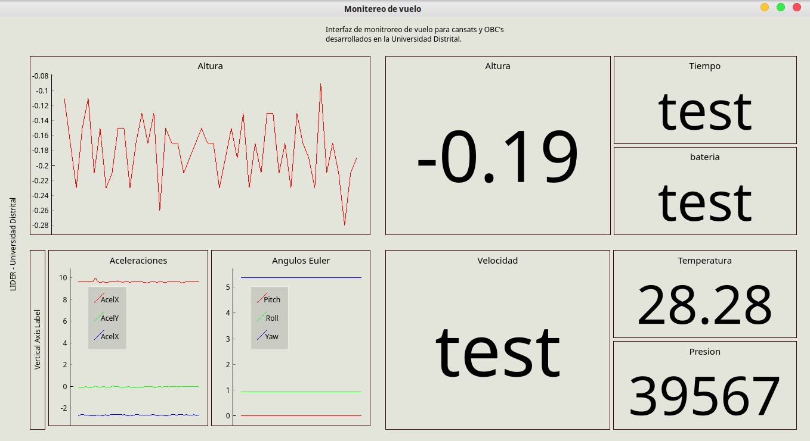

# Estación Terrena
Código para una estación terrena donde se visualizan distintos datos de sensores.

Tiene como proposito el hacer comprensibles los datos que son transmitidos por una OBC (On board computer) o un CanSat por medio de una cadena de texto en un puerto serial.

Sigue en desarrollo. El archivo que conteiene el código es "Interfaz.py"

Este proyecto está fuertemente relacionado con
otro proyecto de [ciencia de cohetes y CanSats](https://github.com/el-NASA/POA).

Además para poder ejecutarla tienes que tener las siguientes librerias:
* PyQtgraph
* Numpy
* Serial
* Qt (versión 4 ó 5)

Desarrollada por Daniel Alejandro Rodriguez Suarez, líder del semillero de investigación ATL, vinculado al grupo de investigación LIDER de la Universidad Distrital.
